# BeMadRalphy

**Be**(ads) + (B)**Mad** + **Ralphy** + [OpenSpec](https://github.com/Fission-AI/OpenSpec) — four tools, one pipeline, zero gaps. **CLI-only.**

> End-to-end automated coding: idea in → planning → task graph → swarm-aware execution → living specs → deployment.

[](LICENSE)

## Status

BeMadRalphy has an initial TypeScript scaffolding in this repo. The CLI commands are stubbed and not yet functional, and the npm package is not released. The sections below describe the **planned** interface and architecture, with the current scaffolding focused on file generation and placeholders.

Current scaffolding includes:

- `idea.md`/`plan.md` intake with `.bemadralphy/intake.yaml` output
- Placeholder BMAD outputs under `_bmad-output/`
- Steering file generation (AGENTS.md, CLAUDE.md, Cursor/Windsurf/Cline/Kiro rules)
- `tasks.md` generation and `.beads/issues.jsonl` placeholders
- Per-phase state persistence in `.bemadralphy/state.yaml`
- Execution phase can run `bd ready` when Beads + engine CLIs are available

---

## What is BeMadRalphy?

BeMadRalphy is a CLI orchestrator that merges:

- **[BMAD-METHOD](https://github.com/bmad-method/BMAD-METHOD)** — Agile AI-driven planning (product briefs, PRDs, architecture, epics & stories)
- **[Beads](https://github.com/beads-ai/beads)** — Git-backed graph issue tracker and persistent AI memory
- **[Ralphy](https://github.com/ralphy-ai/ralphy)** — Autonomous AI coding loop with multi-engine support
- **[OpenSpec](https://github.com/Fission-AI/OpenSpec)** — Living specifications and delta-based change tracking

Into a single, seamless pipeline that takes you from a rough idea to a deployed, documented, and tested codebase — with minimal human intervention.

---

## The 9-Phase Pipeline

```mermaid
flowchart TD
  subgraph explore [Phase 0: Explore]
    ExploreCmd[bemadralphy explore]
    ExploreReport[Exploration report]
  end
  subgraph intake [Phase 1: Idea Intake]
    IdeaMD[idea.md]
    DetectMode{Greenfield or brownfield?}
    IntakeYAML[intake.yaml]
  end
  subgraph planning [Phase 2: Planning]
    Brief[Product brief]
    PRD[PRD]
    Arch[Architecture]
    Stories[Epics and stories]
  end
  subgraph steer [Phase 3: Agent Steering]
    AllFiles[14+ steering files]
  end
  subgraph scaffold [Phase 4: Scaffolding]
    GitInit[git init + monorepo]
    PkgJson[package.json]
  end
  subgraph tasks [Phase 5: Task Sync]
    Beads[(Beads graph)]
    TasksMD[tasks.md]
  end
  subgraph exec [Phase 6: Execution]
    Detect{Swarm capable?}
    NativeSwarm[Native swarm]
    ProcessParallel[Process parallel]
  end
  subgraph verify [Phase 7: Verification]
    Completeness[Completeness]
    Correctness[Correctness]
    Coherence[Coherence]
  end
  subgraph post [Phase 8: Post-Execution]
    CodeReview[Code review]
    Docs[Documentation]
    Deploy[Deployment]
  end
  ExploreCmd --> ExploreReport --> IdeaMD
  IdeaMD --> DetectMode --> IntakeYAML
  IntakeYAML --> Brief --> PRD --> Arch --> Stories
  Stories --> AllFiles --> GitInit --> PkgJson
  PkgJson --> Beads --> TasksMD
  TasksMD --> Detect
  Detect -->|yes| NativeSwarm
  Detect -->|no| ProcessParallel
  NativeSwarm --> Completeness
  ProcessParallel --> Completeness
  Completeness --> Correctness --> Coherence
  Coherence --> CodeReview --> Docs --> Deploy
```



| Phase                 | What happens                                                                                                           |
| --------------------- | ---------------------------------------------------------------------------------------------------------------------- |
| **0. Explore**        | Optional. Investigate codebase (brownfield) or problem domain (greenfield) before committing to a plan.                |
| **1. Idea Intake**    | Read `idea.md`, detect greenfield vs brownfield, classify project type, ask remaining questions, output `intake.yaml`. |
| **2. Planning**       | Greenfield: product brief → PRD → architecture → stories. Brownfield: proposal → spec deltas → design → tasks.         |
| **3. Agent Steering** | Generate 14+ steering files for every IDE/agent (Cursor, Claude, Copilot, Windsurf, Cline, Kiro, etc.).                |
| **4. Scaffolding**    | `git init`, monorepo structure, `package.json`, `.gitignore`, `.env`, test/lint/CI configs.                            |
| **5. Task Sync**      | Convert stories to Beads issues (`bd create`, `bd dep add`). Generate `tasks.md`. Cost estimate.                       |
| **6. Execution**      | Swarm-aware Beads-driven loop. Native swarm for Claude/Kimi/Codex; process-level parallelism for others.               |
| **7. Verification**   | Semantic check: completeness, correctness, coherence. Fix-up tasks fed back to Beads if needed.                        |
| **8. Post-Execution** | Code review, full docs suite, living specs, deployment, release management, final summary.                             |

---

## Planned AI Engine Support

| Engine                 | Native Swarm      | Notes                       |
| ---------------------- | ----------------- | --------------------------- |
| Claude Code (Opus 4.6) | Yes (Agent Teams) | Lead agent spawns teammates |
| Kimi K2.5              | Yes (PARL)        | Up to 100 sub-agents        |
| OpenAI Codex           | Yes (Agents SDK)  | File reservations           |
| Cursor                 | No                | Process-level parallelism   |
| OpenCode               | No                | Process-level parallelism   |
| Qwen                   | No                | Process-level parallelism   |
| Droid                  | No                | Process-level parallelism   |
| GitHub Copilot         | No                | Process-level parallelism   |
| Gemini                 | No                | Process-level parallelism   |

---

## Autonomy Modes

| Mode                                 | Description                                                                                      |
| ------------------------------------ | ------------------------------------------------------------------------------------------------ |
| **Full Autonomous** (`--mode auto`)  | Zero pauses after Q&A. Everything runs unattended.                                               |
| **Hybrid** (`--mode hybrid`)         | Planning gates only (after brief, PRD, architecture, stories). Execution is autonomous. Default. |
| **Supervised** (`--mode supervised`) | Planning gates + execution milestones (after scaffolding, each epic, before deployment).         |

---

## CLI Commands (planned)

The following commands represent the intended CLI interface. Current implementations are placeholders and may only create placeholder outputs.

```bash
# Initialize a new project
npx bemadralphy init

# Notes:
# - Creates .bemadralphy/, openspec/, and _bmad-output/
# - Attempts `bd init` if Beads is installed
# - Warns if BMAD CLI is missing

# Run the full pipeline
npx bemadralphy run

# Run with specific options
npx bemadralphy run --mode auto --engine claude --max-parallel 5 --budget 50

# Explore before planning (optional)
npx bemadralphy explore "How should I structure authentication?"

# Check pipeline status
npx bemadralphy status
```

---

## The `idea.md` File

BeMadRalphy starts with an `idea.md` file in your project root. It can be as simple or detailed as you want. The current scaffolding writes intake results to `.bemadralphy/intake.yaml`.

### Minimal example

```markdown
I want to build a SaaS dashboard for tracking fitness goals.
```

### Detailed example with YAML front-matter

```yaml
---
project_type: full-stack
stack:
  frontend: Next.js
  backend: Hono
  language: TypeScript
runtime: bun
monorepo: true
database: Postgres
auth: Clerk
tests: Vitest
deployment: Vercel
---

A SaaS dashboard for tracking fitness goals. Users can log workouts,
track progress over time, set goals, and get AI-powered recommendations.

Key features:
- User authentication with social login
- Workout logging with exercise library
- Progress charts and analytics
- Goal setting and tracking
- AI coach for personalized recommendations
```

BeMadRalphy extracts what you've already decided and only asks about the rest.

---

## Greenfield vs Brownfield

| Mode           | When                       | What happens                                                                         |
| -------------- | -------------------------- | ------------------------------------------------------------------------------------ |
| **Greenfield** | No existing codebase       | Full pipeline: idea → PRD → architecture → stories → build from scratch              |
| **Brownfield** | Existing codebase detected | Analyze codebase, generate proposal + spec deltas, skip scaffolding, execute changes |

Brownfield is auto-detected (looks for `package.json`, `src/`, etc.) or forced with `--brownfield`.

---

## Living Specs (OpenSpec-compatible)

After the initial build, BeMadRalphy generates living specifications in `openspec/specs/`:

```text
openspec/
├── specs/
│   ├── auth/spec.md
│   ├── workouts/spec.md
│   └── goals/spec.md
├── changes/
│   └── archive/
```

For subsequent brownfield changes, new requirements are expressed as **delta specs** (ADDED/MODIFIED/REMOVED) against the current specs. On completion, deltas merge into the main specs.

---

## Target Project Structure (after scaffolding)

```text
your-project/
├── .bemadralphy/          # State, cost log, failures log, intake.yaml
│   ├── state.yaml
│   ├── cost.log
│   └── failures.log
├── .beads/                # Beads task graph
│   └── issues.jsonl
├── _bmad/                 # BMAD playbooks (read-only)
├── _bmad-output/          # Planning artifacts
│   ├── product-brief.md
│   ├── prd.md
│   ├── architecture.md
│   └── stories/
├── openspec/              # Living specs
│   └── specs/
├── docs/
│   ├── adr/               # Architecture Decision Records
│   ├── onboarding.md
│   └── runbook.md
├── src/                   # Your application code
├── tests/
├── .github/
│   ├── workflows/
│   ├── ISSUE_TEMPLATE/
│   └── pull_request_template.md
├── AGENTS.md              # Universal agent steering
├── CLAUDE.md              # Claude-specific steering
├── .cursorrules           # Cursor-specific steering
├── idea.md                # Your original idea
├── .bemadralphy/intake.yaml  # Processed intake
├── tasks.md               # Human-readable task list
├── package.json
└── README.md
```

---

## Configuration (planned)

### `.bemadralphy/state.yaml`

Tracks pipeline state for resumability:

```yaml
phase: execution
mode: hybrid
engine: claude
last_gate: architecture
tasks_completed: 12
tasks_total: 24
cost_usd: 3.47
```

### Flags

| Flag                              | Description                             |
| --------------------------------- | --------------------------------------- |
| `--mode auto\|hybrid\|supervised` | Autonomy mode                           |
| `--engine <name>`                 | AI engine to use                        |
| `--planning-engine <name>`        | Override engine for planning phase only |
| `--max-parallel N`                | Max parallel tasks (default: 3)         |
| `--budget N`                      | Cost cap in USD                         |
| `--brownfield`                    | Force brownfield mode                   |
| `--swarm native\|process\|off`    | Override swarm detection                |
| `--create-pr`                     | Create PRs for each task                |

---

## Installation (planned)

The CLI is not published to npm yet. These commands represent the intended install flow.

```bash
# Run directly with npx
npx bemadralphy init

# Or install globally
npm install -g bemadralphy
bemadralphy init
```

### Prerequisites

- Node.js 18+ or Bun 1.0+
- Git
- At least one supported AI engine CLI installed (e.g., `claude`, `cursor`, `codex`)
- Beads CLI (`bd`) — installed automatically by `bemadralphy init`

---

## Quick Start (planned)

```bash
# 1. Create a new directory
mkdir my-awesome-app && cd my-awesome-app

# 2. Initialize BeMadRalphy
npx bemadralphy init

# 3. Write your idea
echo "A todo app with real-time sync and offline support" > idea.md

# 4. Run the pipeline
npx bemadralphy run
```

That's it. BeMadRalphy will:

1. Ask clarifying questions about your stack preferences
2. Generate a full PRD and architecture
3. Create all the steering files for your AI agents
4. Scaffold the project
5. Execute all tasks with tests
6. Verify the implementation
7. Generate documentation and deploy

---

## Contributing

See [CONTRIBUTING.md](CONTRIBUTING.md) for guidelines on:

- Fork/clone workflow
- Branch naming conventions
- Commit message format
- PR process
- Code standards

---

## License

[MIT](LICENSE) — Copyright (c) 2026 hxp-pxh

---

## Acknowledgments

BeMadRalphy builds on the shoulders of giants:

- [BMAD-METHOD](https://github.com/bmad-method/BMAD-METHOD) — The planning framework
- [Beads](https://github.com/beads-ai/beads) — The task graph and memory layer
- [Ralphy](https://github.com/ralphy-ai/ralphy) — The execution loop inspiration
- [OpenSpec](https://github.com/Fission-AI/OpenSpec) — The living spec model
