# BeMadRalphy

**Be**(ads) + (B)**Mad** + **Ralphy** + [OpenSpec](https://github.com/Fission-AI/OpenSpec) — four tools, one pipeline, zero gaps. **CLI-only.**

BeMadRalphy is a product-delivery operating system for AI-assisted teams: methodology first, code generation second.

> End-to-end automated coding: idea in → planning → task graph → swarm-aware execution → living specs → deployment.

[](https://www.npmjs.com/package/bemadralphy)
[](https://www.npmjs.com/package/bemadralphy)
[](LICENSE)

## Status

BeMadRalphy runs end-to-end locally with real external CLI integrations.

Current implementation includes:

- `idea.md`/`plan.md` intake with `.bemadralphy/intake.yaml` output
- BMAD bootstrap (`bmad install`) and generated planning artifacts under `_bmad-output/`
- Steering file generation (AGENTS.md, CLAUDE.md, Cursor/Windsurf/Cline/Kiro rules)
- `tasks.md` generation plus Beads sync (`bd init`, `bd create`, `bd ready`, `bd close`, `bd update`)
- Per-phase state persistence in `.bemadralphy/state.yaml`
- Engine execution through explicit CLI contracts for all supported engines
- OpenSpec lifecycle integration (`openspec init`, `openspec validate`, `openspec archive`)

---

## Start Here

- First local run guide: [`docs/getting-started.md`](docs/getting-started.md)
- Contributor/developer setup: [`docs/onboarding.md`](docs/onboarding.md)
- Architecture and flow details: [`docs/architecture.md`](docs/architecture.md)

---

## What is BeMadRalphy?

BeMadRalphy is a CLI orchestrator that merges:

- **[BMAD-METHOD](https://github.com/bmad-code-org/BMAD-METHOD)** — Agile AI-driven planning (product briefs, PRDs, architecture, epics & stories)
- **[Beads](https://github.com/steveyegge/beads)** — Git-backed graph issue tracker and persistent AI memory
- **[Ralphy](https://github.com/michaelshimeles/ralphy)** — Autonomous AI coding loop with multi-engine support ([site](https://ralphy.goshen.fyi/))
- **[OpenSpec](https://github.com/Fission-AI/OpenSpec)** — Living specifications and delta-based change tracking

Into a single, seamless pipeline that takes you from a rough idea to a deployed, documented, and tested codebase — with minimal human intervention.

### Positioning and ICP

- Primary ICP: product teams of 2-10 engineers shipping continuously
- Secondary ICPs: solo builders and agencies operating repeatable delivery workflows
- Differentiation: not "write code faster," but "ship products systematically" via BMAD-driven intent-to-delivery

For full positioning rationale and risk mitigation strategy, see [`docs/positioning.md`](docs/positioning.md).

---

## The 9-Phase Pipeline

```mermaid
flowchart TD
  subgraph explore [Phase 0: Explore]
    ExploreCmd[bemadralphy explore]
    ExploreReport[Exploration report]
  end
  subgraph intake [Phase 1: Idea Intake]
    IdeaMD[idea.md]
    DetectMode{Greenfield or brownfield?}
    IntakeYAML[intake.yaml]
  end
  subgraph planning [Phase 2: Planning]
    Brief[Product brief]
    PRD[PRD]
    Arch[Architecture]
    Stories[Epics and stories]
  end
  subgraph steer [Phase 3: Agent Steering]
    AllFiles[14+ steering files]
  end
  subgraph scaffold [Phase 4: Scaffolding]
    GitInit[git init + monorepo]
    PkgJson[package.json]
  end
  subgraph tasks [Phase 5: Task Sync]
    Beads[(Beads graph)]
    TasksMD[tasks.md]
  end
  subgraph exec [Phase 6: Execution]
    Detect{Swarm capable?}
    NativeSwarm[Native swarm]
    ProcessParallel[Process parallel]
  end
  subgraph verify [Phase 7: Verification]
    Completeness[Completeness]
    Correctness[Correctness]
    Coherence[Coherence]
  end
  subgraph post [Phase 8: Post-Execution]
    CodeReview[Code review]
    Docs[Documentation]
    Deploy[Deployment]
  end
  ExploreCmd --> ExploreReport --> IdeaMD
  IdeaMD --> DetectMode --> IntakeYAML
  IntakeYAML --> Brief --> PRD --> Arch --> Stories
  Stories --> AllFiles --> GitInit --> PkgJson
  PkgJson --> Beads --> TasksMD
  TasksMD --> Detect
  Detect -->|yes| NativeSwarm
  Detect -->|no| ProcessParallel
  NativeSwarm --> Completeness
  ProcessParallel --> Completeness
  Completeness --> Correctness --> Coherence
  Coherence --> CodeReview --> Docs --> Deploy
```



| Phase                 | What happens                                                                                                           |
| --------------------- | ---------------------------------------------------------------------------------------------------------------------- |
| **0. Explore**        | Optional. Investigate codebase (brownfield) or problem domain (greenfield) before committing to a plan.                |
| **1. Idea Intake**    | Read `idea.md`, detect greenfield vs brownfield, classify project type, ask remaining questions, output `intake.yaml`. |
| **2. Planning**       | Greenfield: product brief → PRD → architecture → stories. Brownfield: proposal → spec deltas → design → tasks.         |
| **3. Agent Steering** | Generate 14+ steering files for every IDE/agent (Cursor, Claude, Copilot, Windsurf, Cline, Kiro, etc.).                |
| **4. Scaffolding**    | `git init`, monorepo structure, `package.json`, `.gitignore`, `.env`, test/lint/CI configs.                            |
| **5. Task Sync**      | Convert stories to Beads issues (`bd create`, `bd dep add`). Generate `tasks.md`. Cost estimate.                       |
| **6. Execution**      | Swarm-aware Beads-driven loop. Native swarm for Claude/Kimi/Codex; process-level parallelism for others.               |
| **7. Verification**   | Semantic check: completeness, correctness, coherence. Fix-up tasks fed back to Beads if needed.                        |
| **8. Post-Execution** | Code review, full docs suite, living specs, deployment, release management, final summary.                             |

---

## AI Engine Support

- `claude` (native swarm): `ralphy --claude --max-iterations 1 <task>`
- `kimi` (native swarm): `kimi <task>`
- `codex` (native swarm): `ralphy --codex --max-iterations 1 <task>`
- `cursor`: `ralphy --cursor --max-iterations 1 <task>`
- `opencode`: `ralphy --opencode --max-iterations 1 <task>`
- `qwen`: `ralphy --qwen --max-iterations 1 <task>`
- `copilot`: `ralphy --copilot --max-iterations 1 <task>`
- `gemini`: `gemini <task>`
- `ollama`: `ollama run <model> <task>` (default model via `OLLAMA_MODEL` or `llama3.2`)
- `ralphy`: `ralphy --max-iterations 1 <task>`

---

## Autonomy Modes

| Mode                                 | Description                                                                                      |
| ------------------------------------ | ------------------------------------------------------------------------------------------------ |
| **Full Autonomous** (`--mode auto`)  | Zero pauses after Q&A. Everything runs unattended.                                               |
| **Hybrid** (`--mode hybrid`)         | Planning gates only (after brief, PRD, architecture, stories). Execution is autonomous. Default. |
| **Supervised** (`--mode supervised`) | Planning gates + execution milestones (after scaffolding, each epic, before deployment).         |

---

## CLI Commands

```bash
# Initialize a new project
npx bemadralphy init

# Notes:
# - Creates .bemadralphy/, openspec/, and _bmad-output/
# - Initializes `bd` and `openspec`
# - Fails fast if required CLIs are missing

# Run the full pipeline
npx bemadralphy run

# Run with specific options
npx bemadralphy run --mode auto --engine claude --max-parallel 5 --budget 50

# Run with execution/audience profiles
npx bemadralphy run --execution-profile safe --audience-profile product-team

# Preview pipeline and estimated cost without execution
npx bemadralphy run --dry-run --output json

# Resume a failed/interrupted run
npx bemadralphy run --resume

# Replay a previous run from history
npx bemadralphy replay <runId> --from-phase execute

# Explore before planning (optional)
npx bemadralphy explore "How should I structure authentication?"

# Check pipeline status
npx bemadralphy status

# Show run history (human or JSON)
npx bemadralphy history
npx bemadralphy history --output json

# Check local dependency readiness
npx bemadralphy doctor
npx bemadralphy doctor --output json
```

---

## The `idea.md` File

BeMadRalphy starts with an `idea.md` file in your project root. It can be as simple or detailed as you want. The current scaffolding writes intake results to `.bemadralphy/intake.yaml`.

### Minimal example

```markdown
I want to build a SaaS dashboard for tracking fitness goals.
```

### Detailed example with YAML front-matter

```yaml
---
project_type: full-stack
stack:
  frontend: Next.js
  backend: Hono
  language: TypeScript
runtime: bun
monorepo: true
database: Postgres
auth: Clerk
tests: Vitest
deployment: Vercel
---

A SaaS dashboard for tracking fitness goals. Users can log workouts,
track progress over time, set goals, and get AI-powered recommendations.

Key features:
- User authentication with social login
- Workout logging with exercise library
- Progress charts and analytics
- Goal setting and tracking
- AI coach for personalized recommendations
```

BeMadRalphy extracts what you've already decided and only asks about the rest.

---

## Greenfield vs Brownfield

| Mode           | When                       | What happens                                                                         |
| -------------- | -------------------------- | ------------------------------------------------------------------------------------ |
| **Greenfield** | No existing codebase       | Full pipeline: idea → PRD → architecture → stories → build from scratch              |
| **Brownfield** | Existing codebase detected | Analyze codebase, generate proposal + spec deltas, skip scaffolding, execute changes |

Brownfield is auto-detected (looks for `package.json`, `src/`, etc.) or forced with `--brownfield`.

---

## Living Specs (OpenSpec-compatible)

After the initial build, BeMadRalphy generates living specifications in `openspec/specs/`:

```text
openspec/
├── specs/
│   ├── auth/spec.md
│   ├── workouts/spec.md
│   └── goals/spec.md
├── changes/
│   └── archive/
```

For subsequent brownfield changes, new requirements are expressed as **delta specs** (ADDED/MODIFIED/REMOVED) against the current specs. On completion, deltas merge into the main specs.

---

## Target Project Structure (after scaffolding)

```text
your-project/
├── .bemadralphy/          # State, cost log, failures log, intake.yaml
│   ├── state.yaml
│   ├── cost.log
│   └── failures.log
├── .beads/                # Beads task graph
│   └── issues.jsonl
├── _bmad/                 # BMAD playbooks (read-only)
├── _bmad-output/          # Planning artifacts
│   ├── product-brief.md
│   ├── prd.md
│   ├── architecture.md
│   └── stories/
├── openspec/              # Living specs
│   └── specs/
├── docs/
│   ├── adr/               # Architecture Decision Records
│   ├── onboarding.md
│   └── runbook.md
├── src/                   # Your application code
├── tests/
├── .github/
│   ├── workflows/
│   ├── ISSUE_TEMPLATE/
│   └── pull_request_template.md
├── AGENTS.md              # Universal agent steering
├── CLAUDE.md              # Claude-specific steering
├── .cursorrules           # Cursor-specific steering
├── idea.md                # Your original idea
├── .bemadralphy/intake.yaml  # Processed intake
├── tasks.md               # Human-readable task list
├── package.json
└── README.md
```

---

## Configuration

### `.bemadralphy/state.yaml`

Tracks pipeline state for resumability and recovery:

```yaml
phase: execution
mode: hybrid
engine: claude
last_gate: architecture
tasks_completed: 12
tasks_total: 24
cost_usd: 3.47
status: running
resumeFromPhase: execute
```

Resume and replay behavior:

- `--resume` retries the failed phase when a run fails.
- `--resume` starts at the next phase when the previous phase completed successfully.
- completed runs clear `resumeFromPhase`, so a later `--resume` starts fresh instead of re-running `post`.
- `replay <runId>` resolves from the latest run-history record for that `runId` (not the first row).

Run/cost logs are append-only JSONL and use atomic append writes:

- `.bemadralphy/runs.jsonl` (history)
- `.bemadralphy/cost.log` (cost tracking)
- `.bemadralphy/failures.log` (phase failures)

### Run defaults via config file

You can define persistent defaults in either `.bemadralphyrc` (YAML/JSON) or `bemad.config.js`.

Example `.bemadralphyrc`:

```yaml
mode: hybrid
engine: ollama
maxParallel: 2
executionProfile: balanced
output: text
plugins:
  - ./bemad.plugins/local-plugin.mjs
```

Example `bemad.config.js`:

```js
export default {
  mode: 'hybrid',
  engine: 'ralphy',
  output: 'json',
};
```

CLI flags always override config file values.

### Flags

| Flag                              | Description                             |
| --------------------------------- | --------------------------------------- |
| `--mode auto\|hybrid\|supervised` | Autonomy mode                           |
| `--engine <name>`                 | AI engine to use                        |
| `--planning-engine <name>`        | Override engine for planning phase only |
| `--max-parallel N`                | Max parallel tasks (default: 3)         |
| `--execution-profile <profile>`   | Guardrails profile: `safe\|balanced\|fast` |
| `--audience-profile <profile>`    | ICP profile: `solo-dev\|agency-team\|product-team\|enterprise-team` |
| `--budget N`                      | Cost cap in USD                         |
| `--brownfield`                    | Force brownfield mode                   |
| `--swarm native\|process\|off`    | Override swarm detection                |
| `--create-pr`                     | Create PRs for each task                |
| `--dry-run`                       | Preflight plan + cost estimate only     |
| `--resume`                        | Resume from latest checkpoint           |
| `--from-phase <name>`             | Start at a specific phase               |
| `--output text\|json`             | Human-readable or structured output     |
| `--plugin <paths...>`             | Load custom plugin modules              |

### Execution profiles

- `safe`: single-lane execution defaults, process-mode bias, lowest coordination risk
- `balanced` (default): controlled concurrency for day-to-day product work
- `fast`: maximum requested concurrency for throughput-focused runs

---

## Installation

### Quick Install (Recommended)

```bash
# npm
npm install -g bemadralphy

# pnpm
pnpm add -g bemadralphy

# bun
bun add -g bemadralphy

# yarn
yarn global add bemadralphy

# or use the install script
curl -fsSL https://raw.githubusercontent.com/hxp-pxh/BeMadRalphy/main/install.sh | bash
```

Verify the install:

```bash
bemadralphy --version
bemadralphy --help
```

If your shell cannot find `bemadralphy` right after global install:

```bash
# still works without global PATH wiring
npx bemadralphy --help

# if you use a custom npm prefix, add its bin dir to PATH
export PATH="$(npm config get prefix)/bin:$PATH"
```

### Docker

```bash
# Pull from GitHub Container Registry
docker pull ghcr.io/hxp-pxh/bemadralphy:latest

# Run
docker run -v $(pwd):/workspace ghcr.io/hxp-pxh/bemadralphy init
```

For detailed first-run setup, see [`docs/getting-started.md`](docs/getting-started.md).

### Install required external CLIs

```bash
# Ralphy
sudo npm install -g ralphy-cli

# BMAD
sudo npm install -g bmad-method

# Beads
sudo npm install -g @beads/bd

# OpenSpec
sudo npm install -g @fission-ai/openspec
```

Verify:

```bash
ralphy --version
bmad --version
bd --version
openspec --version
```

### Install BeMadRalphy dependencies

```bash
npm install
npm run build
node dist/cli.js --help
```

### Prerequisites

- Node.js 18+ or Bun 1.0+
- Git
- Ralphy CLI (`ralphy`) for execution fallback and parallel orchestration
- BMAD CLI (`bmad`)
- Beads CLI (`bd`)
- OpenSpec CLI (`openspec`)
- Optional local engine: Ollama (`ollama`) when using `--engine ollama`

## Fail-Fast Behavior

`init` and `run` are strict by design for local-product reliability:

- Missing required CLIs fail immediately with actionable errors.
- Planning fails if BMAD command fails or required artifacts are missing.
- Sync fails if stories cannot be parsed or Beads writes fail.
- Execute fails for unknown/unavailable engines.
- Verify/Post fail if OpenSpec commands fail.

`init` is now soft for onboarding:

- Always scaffolds `.bemadralphy/`, `openspec/`, `_bmad-output/`, and starter `idea.md`.
- If `bd`, `bmad`, or `openspec` are missing, it attempts `npm install -g` automatically.
- If those CLIs already exist and npm is available, it checks for newer npm releases and upgrades to latest when needed.
- If auto-install/update fails, `init` still completes with warnings and reports actionable install hints.
- Use `bemadralphy doctor` to check readiness before full pipeline runs.

Typical recovery flow:

```bash
# 1) Verify toolchain
ralphy --version && bmad --version && bd --version && openspec --version

# 2) Re-run setup and checks
npm install
npm run verify
node dist/cli.js init

# 3) Run pipeline
node dist/cli.js run --mode auto --engine ralphy
```

---

## Quick Start

```bash
# 1. Create a new directory
mkdir my-awesome-app && cd my-awesome-app

# 2. Initialize BeMadRalphy
npx bemadralphy init

# 3. Write your idea
echo "A todo app with real-time sync and offline support" > idea.md

# 4. Run the pipeline
npx bemadralphy run
```

For full expected outputs and fail-fast troubleshooting, see [`docs/getting-started.md`](docs/getting-started.md).

That's it. BeMadRalphy will:

1. Ask clarifying questions about your stack preferences
2. Generate a full PRD and architecture
3. Create all the steering files for your AI agents
4. Scaffold the project
5. Execute all tasks with tests
6. Verify the implementation
7. Generate documentation and deploy

---

## Contributing

See [CONTRIBUTING.md](CONTRIBUTING.md) for guidelines on:

- Fork/clone workflow
- Branch naming conventions
- Commit message format
- PR process
- Code standards

---

## License

[MIT](LICENSE) — Copyright (c) 2026 hxp-pxh

---

## Acknowledgments

BeMadRalphy builds on the shoulders of giants:

- [BMAD-METHOD](https://github.com/bmad-code-org/BMAD-METHOD) — The planning framework
- [Beads](https://github.com/steveyegge/beads) — The task graph and memory layer
- [Ralphy](https://github.com/michaelshimeles/ralphy) — The execution loop inspiration ([site](https://ralphy.goshen.fyi/))
- [OpenSpec](https://github.com/Fission-AI/OpenSpec) — The living spec model
